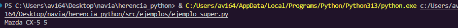
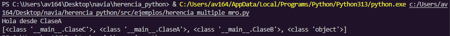
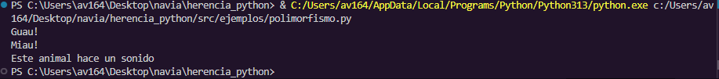
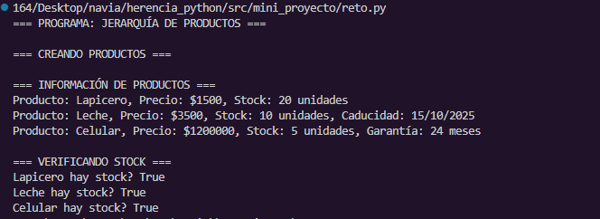

**EJEMPLOS**

# ejemplo_super

Este ejemplo muestra cómo una clase hija (Automóvil) puede llamar al constructor de su clase padre (Vehículo) usando la función super(). Esto permite inicializar correctamente los atributos heredados sin necesidad de reescribir código, asegurando una mejor organización y evitando errores.

# aprendizaje

Con este ejemplo aprendí que super() es muy útil cuando se trabaja con herencia, ya que facilita la reutilización de código, mejora la legibilidad y garantiza que la clase padre siempre se ejecute correctamente al crear un objeto hijo.

# como ejecutarlo:
    Abrir la terminal en la carpeta `src/ejemplos/` y ejecutar:
    python ejemplo_super.py

# ejemplo de salida:

# herencia_multiple_mro

Este ejemplo muestra cómo una clase puede heredar de dos o más clases a la vez. En el caso trabajado, una clase ClaseC hereda de ClaseA y ClaseB. Gracias a esto, ClaseC puede acceder a los métodos definidos en ambas clases, demostrando la flexibilidad de la herencia múltiple.

# aprendizaje

Con este ejemplo aprendí que la herencia múltiple permite combinar comportamientos de varias clases, pero también puede generar conflictos si las clases padres tienen métodos con el mismo nombre. Para resolver estos casos, Python utiliza el MRO (Method Resolution Order), que establece el orden en el que se buscan los métodos en la jerarquía.

# como ejecutarlo:
    Abrir la terminal en la carpeta `src/ejemplos/` y ejecutar:
    python herencia_multiple_mro.py

# ejemplo de salida:

# polimorfismo

Este ejemplo muestra cómo varias clases hijas (Perro, Gato, etc.) heredan de una clase padre (Animal) y sobreescriben el método hablar() para dar su propio comportamiento. Así, aunque todas las clases comparten la misma interfaz (el método hablar), cada una responde de manera distinta según su naturaleza.

# aprendizaje

Con este ejemplo aprendí que el polimorfismo permite que diferentes objetos respondan de manera única a la misma acción, haciendo el código más flexible y fácil de mantener. Gracias a la sobreescritura de métodos, se puede personalizar el comportamiento de las clases hijas sin alterar la clase padre.

# como ejecutarlo:
    Abrir la terminal en la carpeta `src/ejemplos/` y ejecutar:
    python polimorfismo.py

# ejemplo de salida:

# vehiculo_auto

Este ejemplo muestra cómo la clase Automóvil hereda de la clase Vehículo. La clase padre define atributos y métodos generales (como marca o modelo), mientras que la clase hija aprovecha esa base y puede añadir o personalizar características propias. De esta forma, se evidencia el uso de la herencia para evitar duplicación de código

# aprendizaje

Con este ejemplo aprendí que la herencia básica permite construir clases hijas a partir de clases padres, reutilizando atributos y métodos ya definidos. Esto hace que el programa sea más organizado, fácil de leer y de mantener, además de fomentar la reutilización de código.

# como ejecutarlo:
    Abrir la terminal en la carpeta `src/ejemplos/` y ejecutar:
    python vehiculo_auto.py

# ejemplo de salida:

**MINI_PROYECTO**

# Reto 

Este proyecto demuestra el uso de herencia, sobreescritura de métodos, polimorfismo y reutilización de código en Python, a través de una jerarquía de productos. Se parte de una clase base (Producto) y se construyen clases hijas (Alimento y Electrónico) que amplían y personalizan sus funcionalidades.

# Explicación del Reto

El reto consiste en implementar una jerarquía de productos aplicando herencia en la Programación Orientada a Objetos (POO). La clase base Producto define atributos comunes como nombre, precio y stock. A partir de ella:

**Alimento agrega el atributo de fecha de caducidad.

**Electrónico añade el atributo de garantía.

Cada clase hija sobrescribe el método de mostrar información, adaptándolo a sus características específicas. Además, se crean instancias para verificar tanto la presentación de datos como la disponibilidad de stock. Esto permite evidenciar cómo la herencia facilita la extensión y reutilización del código.

# como ejecutarlo:
    Abrir la terminal en la carpeta `src/mini_proyecto/` y ejecutar:
    python reto.py

# ejemplo de salida:
